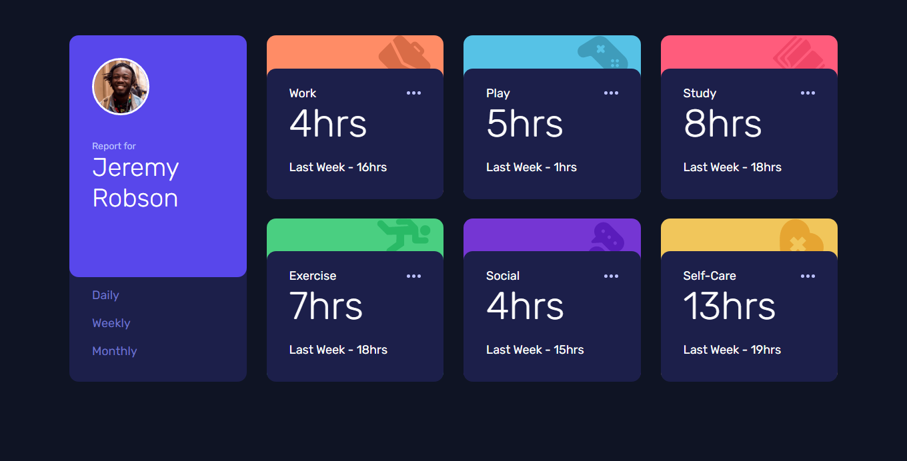
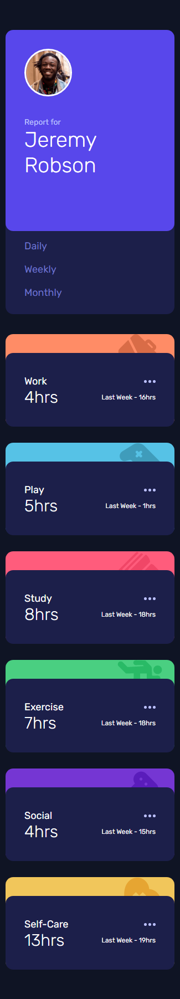

# Frontend Mentor - Time tracking dashboard solution

This is a solution to the [Time tracking dashboard challenge on Frontend Mentor](https://www.frontendmentor.io/challenges/time-tracking-dashboard-UIQ7167Jw). Frontend Mentor challenges help you improve your coding skills by building realistic projects.

## Table of contents

- [Frontend Mentor - Time tracking dashboard solution](#frontend-mentor---time-tracking-dashboard-solution)
  - [Table of contents](#table-of-contents)
  - [Overview](#overview)
    - [The challenge](#the-challenge)
    - [Screenshot](#screenshot)
    - [Links](#links)
  - [My process](#my-process)
    - [Built with](#built-with)
  - [Author](#author)

## Overview

### The challenge

Users should be able to:

- View the optimal layout for the site depending on their device's screen size
- See hover states for all interactive elements on the page
- Toggle color theme to their preference

### Screenshot

### Links

- Solution URL: [Solution](https://www.frontendmentor.io/solutions/social-media-dashboard-with-theme-using-bem-and-vanilla-js-DhtHrMEil)
- Live Site URL: [Live preview](https://social-dashboard-anthony-rosman.netlify.app/)

## My process

### Built with

- React
- CSS custom properties
- Flexbox
- CSS Grid
- Desktop-first workflow

## Author

<!-- - Website - [Anthony Rosman](https://bit.ly/portafolioanthony) -->

- Frontend Mentor - [@D3press3dd](https://www.frontendmentor.io/profile/D3press3dd)
